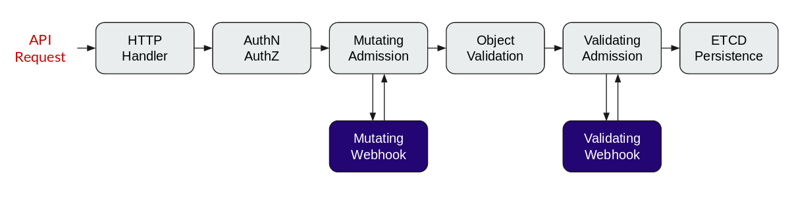

# OPA Kubernetes validation and mutation testing environment


This project makes easy to develop `deny` rules and `patches` mutations. In this repository you will find a `main.rego` file wich is in charge of generate the expected Kubernetes API `json` response in the Validation and mutation stage a long with a set of basic `deny` rules and it's tests + mocks.

## TL;DR

```bash
$ opa test -v .
[angel@elitebook opa-k8s-development]$ opa test -v .
data.kubernetes.admission.test_create_ingress_existing_in_other_namespace: PASS (719.34µs)
data.kubernetes.admission.test_create_client_valid_ingress: PASS (503.277µs)
data.system.test_default_response: PASS (495.764µs)
data.kubernetes.admission.test_invalid_client_pod_priorityclass: PASS (527.651µs)
data.kubernetes.admission.test_valid_client_pod_priorityclass: PASS (472.089µs)
--------------------------------------------------------------------------------
PASS: 5/5

```

## OPA Webhooks

OPA and Kubernetes has to be configured registering a validation and mutation webhook into Kubernetes API. This topic is out of the scope of this project but you can read more about it in the [official OPA documentation](https://www.openpolicyagent.org/docs/latest/kubernetes-admission-control).

But, you have to keep in your mind the following diagram:



The important thing here is to know that the mutation phase is triggered before the validation one.

## Project structure

This repository contains three different tpyes of rego files to make it easy to extend this environment:

- `[KIND].rego`: This files contains the `deny` or `pathes` rules to validate or mutate a request.
- `[KIND]-test.rego`: This ones contains a set of test related to the testing kind specified in it's name.
- `[KIND]-mocks.rego`: This files contains a series of Kubernetes requests to use as mocked requests in tests.

There are also a couple of special rego files:

- `main.rego` and `main-test.rego`: Contains the structures to build the kubernetes api responses used to validate and mutate the incoming requests.

### main.rego

```rego
package system

import data.kubernetes.admission

main = {
	"apiVersion": "admission.k8s.io/v1beta1",
	"kind": "AdmissionReview",
	"response": response,
}

default response = {"allowed": true}

response = {
	"allowed": false,
	"status": {"reason": reason},
} {
	reason := concat(", ", admission.deny)
	reason != ""
}

response = {
	"allowed": true,
	"patchType": "JSONPatch",
	"patch": patch_bytes,
} {
	reason := concat(", ", admission.deny)
	reason == ""
	patch := {xw | xw := admission.patches[_][_]}
	patch_json := json.marshal(patch)
	patch_bytes := base64.encode(patch_json)
}
```

Let's review this **important** file. The `main` structure contains the common part of a validate and mutate response. In the `main` structure it's present a `response` attribute. This attribute will get three different values depending of the rules (deny and patches) applied to the incoming requests:

- If no deny and no patches applied to the incoming request, it will use the `default response`.
- If not deny rules applied, `reason == ""`, the response will be `"patchType": "JSONPatch",` with the patches applyed to the request *(Can be empty)*.
- If some deny rules returned a reason, `reason != ""`, the response will be `"allowed": false, "status": {"reason": reason},`. The client will get the reason message in the response.

It's really important to know that the same input has to generate only one output. OPA Allows a function to return two different outputs, but kubernetes only accepts one. This is the reason why both (non default) response structure are exclusive using the `reason empty comparation`.


## Using it

To use this testing environment you will need to clone this repository and download the latest [OPA](https://www.openpolicyagent.org/) release *(actual version: [v0.13.5](https://github.com/open-policy-agent/opa/releases/tag/v0.13.5))*. It's not needed to have a kubernetes cluster. Remember, this project is useful in the [OPA](https://www.openpolicyagent.org/) rules/mutations development stage.


The following commands has been executed in a [`centos:7` container image](https://hub.docker.com/_/centos?tab=tags) to make it repeatable and cleaner:
```bash
$ docker run -it --rm centos:7 /bin/bash
[root@d8997b63a370 /]# yum install -y wget git # Output hidden
[root@d8997b63a370 /]# git clone https://github.com/k8spin/opa-k8s-development.git
Cloning into 'opa-k8s-development'...
remote: Enumerating objects: 26, done.
remote: Counting objects: 100% (26/26), done.
remote: Compressing objects: 100% (20/20), done.
remote: Total 26 (delta 10), reused 19 (delta 5), pack-reused 0
Unpacking objects: 100% (26/26), done.
[root@d8997b63a370 /]# wget -q https://github.com/open-policy-agent/opa/releases/download/v0.13.5/opa_linux_amd64 -O opa
[root@d8997b63a370 /]# chmod +x opa
[root@d8997b63a370 /]# ./opa test -v opa-k8s-development/
data.kubernetes.admission.test_create_ingress_existing_in_other_namespace: PASS (748.309µs)
data.kubernetes.admission.test_create_client_valid_ingress: PASS (522.186µs)
data.system.test_default_response: PASS (550.857µs)
data.kubernetes.admission.test_invalid_client_pod_priorityclass: PASS (520.333µs)
data.kubernetes.admission.test_valid_client_pod_priorityclass: PASS (609.106µs)
--------------------------------------------------------------------------------
PASS: 5/5
```
